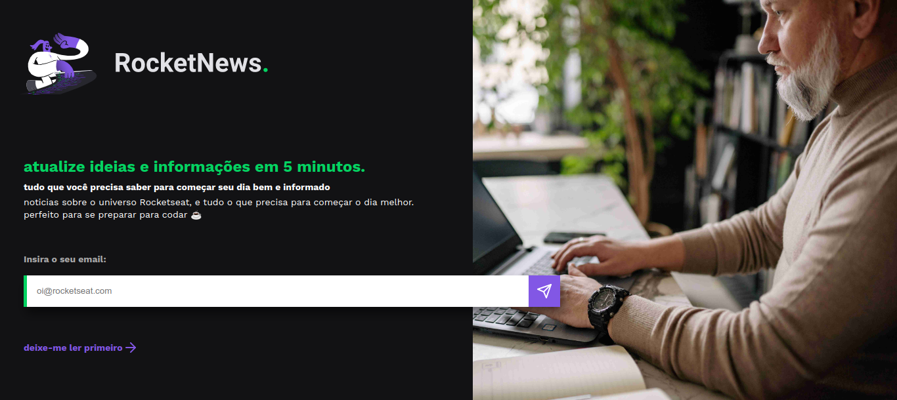

# **RocketNews**
> Neste desafio o objetivo era criar uma página para que o usuario cadastrasse o seu e-mail para receber atualizações de notícias da Rocketseat


> ### 🔗 [Clique aqui para acessar a página do projeto](https://danieldemoura.github.io/RocketNews)


## 🧰 **Techs utilizadas**

- HTML
- CSS
- JavaScript
- Figma


## 🧑‍💻 **Código JS que exibi o alert()**

```
let buttonSubmit = document.getElementById("submit-email");
let inputEmail = document.getElementById("email");


buttonSubmit.addEventListener('click', formSent);

function formSent() {

    if (inputEmail.value != "") {
        alert("E-mail cadastrado, agora você será atualizado sobre tudo que acontece na Rocketseat");
    }
}

```